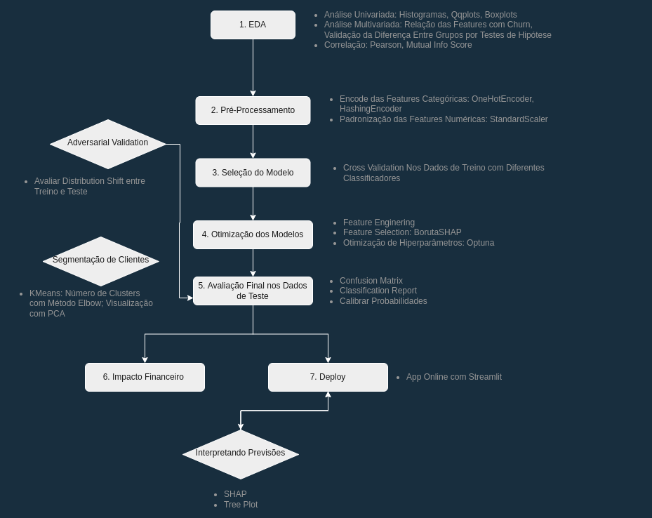
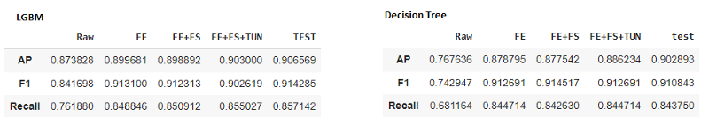
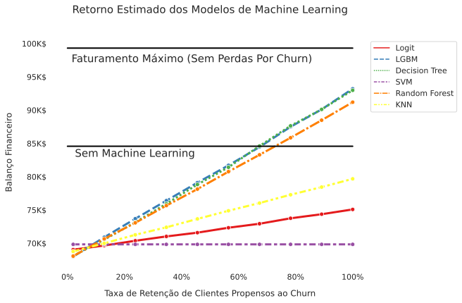

# Análise da Rotatividade de  Clientes (Churn) em Empresa de Telecomunicação 

## Links Úteis
Cada etapa dessa análise foi descrita em um post no Mediun:
- [Parte 1: Análise Exploratória e Geração de Insights](https://medium.com/@vini.guerra87/an%C3%A1lise-de-churn-parte-1-an%C3%A1lise-explorat%C3%B3ria-e-gera%C3%A7%C3%A3o-de-insights-ec7827d3c70c)
- [Parte 2: Modelagem para Machine Learning](https://medium.com/@vini.guerra87/an%C3%A1lise-de-churn-parte-2-modelagem-para-machine-learning-540dcc155eff)
- Parte 3: Deploy
- [Parte 4: Impacto Financeiro dos Modelos de Machine Learning](https://medium.com/@vini.guerra87/an%C3%A1lise-de-churn-parte-4-impacto-financeiro-dos-modelos-de-machine-learning-8d2eb4553605)
- [App online](https://vinitg96-analise-rotatividade-clientes-telco-churn-app-zvjev0.streamlitapp.com/)

## Contexto

A Telco Company é uma empresa fictícia do ramo de telecomunicação que vem sofrendo com uma alta rotação de seus clientes (churn). Nesse projeto, fui contratado para descobrir quais fatores estão levando seus consumidores a abandonar a empresa e propor uma solução capaz de reduzir as perdas financeiras devido a esse problema.

Apesar de armazenar dados dos usúarios, a Telco Company não possui em vigência nenhuma estrátegia para retenção de clientes. A ídeia pincipal é propor um a solução baseada em inteligência artifical capaz de identificar clientes propensos a deixar a empresa e fornecer a eles um incentivo, seja na forma de descontos ou ofertas em planos, com objetivo de fazê-los mudar de ideia e permanecer. Entretanto, é necessário avaliar até que ponto o custo atrelado a esses incentivos é vantajoso ou não frente ao cenário atual.

Coonversando com os gestores a meta estabelecida foi identificar corretamente pelo menos 70% dos clientes com intenção de deixar a empresa. Além disso, também foi solicitado que a solução final seja na forma de um App online com uso simples.

Os dados utilizados são oriundos da competição Customer Churn Prediction 2020. A solução final consistiu em um App online contruído com o streamlit. A aplicação contém um dashboard interativo com informações dos clientes, o modelo final treinado e apto a receber novos dados para realizar previsões além de um resumo com os insights gerados. O repositório pode ser acessado aqui.

## Objetivos
- Entender fatores que ocasionam o churn em empresas de telecomunicação gerando insitghts que possam auxiliar os tomadores de decisões.
-  Treinar um modelo de Machine Learning para prever a probabilidade de um cliente vir a abandonar a empresa e segmentar os clientes em grupos com base em seu comportamento.
- Realizar o deploy do modelo treinado na forma de uma aplicação online.
- Avaliar o impacto financeiro da solução proposta.

## Metodologia

## Resultados

### Aspectos de Business
- Os clientes que saem da empresa são em média 12% mais lucrativos do que os que permanecem, o que evidencia a importância de reduzir o churn.
- Clientes que fazem o churn realizam 54% mais chamadas de serviço ao consumidor e enviam cerca de 40% menos mensagens por voz do que clientes que permanecem.
- Clientes que fazem o churn são mais ativos no período da manhã do que clientes que permanecem.
- A adesão apenas do plano internacional parece estar relacionada com uma maior evasão, tendo em vista que mais de 20% dos clientes rotativos possuem somente esse plano enquanto a porcentagem dos que permanecem e tem esse mesmo plano é de apenas 10%.
- A taxa de churn variou de 5% a 26% com uma média de 14% (± 5%) nos estados americanos.
- California (CA) e Virginia Ocidental(WV) e Carolina do Sul (SC) foram estados problemáticos. CA foi o estado com a segunda maior taxa de churn e o menor número de clientes, talvez reflexo da forte concorrência por se tratar de um dos estados mais populosos do EUA. WV e SC apresentaram um alto número de clientes e uma baixa renda média, o que abre a possibilidade de tentar um pequeno reajuste afim de aumentar a rentabilidade nesses locais.
- Por outro lado Wisconsin (WI) e Virginia (VA) foram estados com alto número de clientes e baixa taxa de churn, mostrando que nesses estados a uma fidelidade interessante.

### Aspectos Técnicos

- Não houve shift entre os dados de treino e teste, indicando que a validação cruzada deve fornecer estimativas confiáveis.
- Light Gradient Boosting Machine (LGBM) e Decision Tree (DT) foram os melhores modelos para o conjunto de dados, após avaliação em validação cruzada.
- A adição de novas features melhorou significativamente a perfomance dos modelos.
- Feature Selection com BorutaSHAP foi efetiva uma vez que foi possível reduzir o número de features de 24 para 7 com ganho de performance.
- O ajuste dos hiperparâmetros resultou em uma pequena melhoria nas métricas.
- Foi possível identificar corretamente mais de 80% dos clientes rotativos.
- As métricas foram similares entre validação e teste, mostrando que os modelos generalizam bem e estão aptos a receber novos dados.
- A segmentação dos clientes em grupos confirmou que os clientes rotativos tem um comportamento peculiar que permite diferenciá-los dos ativos.

Abaixo estão as métricas dois melhores modelos após cada etapa:

## Impacto Financeiro

- Com a Solução Atual (Sem Machine Learning), as perdas causadas pelo churn foram de aprixamadamente 15% do faturamento total possível (99.317).
- Apenas 3 modelos (LGBM, Decision Tree e Random Forest) tem o potencial de retorno superior a solução atual. Entretanto, isso só ocorre com elevadas taxa de retenção
- Considerando o melhor cenário (retenção de todos os clientes), podemos reduzir as perdas ocasionadas pelo churn de 15% para 6%, o que corresponde a um acréscimo de cerca de 8.700$ no banalnço financeiro da empresa.

## Deploy

[Solução Final Desenvolvida com Streamlit](https://vinitg96-analise-rotatividade-clientes-telco-churn-app-zvjev0.streamlitapp.com/). Caso o site abra com o tema escuro, clique nas três linhas no canto direito superior, depois em settings e selecione o tema claro para melhor visualização das imagens.

https://user-images.githubusercontent.com/53446126/183269107-dfe65dd8-f9af-4155-8169-e44daf3cf37b.mp4

